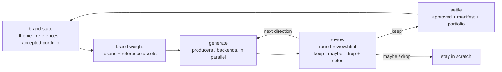

# CLAUDE.md — brand-studio

Developer-facing instructions for working **on** this repo. The runtime
instruction surface for *using* the skill is `skills/brand-studio/SKILL.md`;
this file states the architectural boundary that both the code and `SKILL.md`
must keep. When in doubt, this boundary wins.

## The core boundary

**brand-studio curates and settles brand assets. It does not produce them.**

Production belongs to external producer skills that brand-studio references by
name. brand-studio's job is the durable, deterministic, human-gated spine:
resolve brand state → hand structured brand weight to a producer → seal the
assets the user accepts into a trusted, multimodal corpus.

Everything below follows from that one sentence. A change that makes
brand-studio itself *generate* (images, video, prompts-as-source-of-truth, copy)
is moving the boundary in the wrong direction — flag it instead of shipping it.

## What an "asset" is

Multimodal, uniformly managed and settled: **image, video, brand-tone copy,
slide/deck, logo, social graphic — and anything else that carries the brand.**
The studio runtime is not image-only. Validation, handoff, settle, and report
dispatch by `modality` (`image | video | copy | slide | ...`), never by a
hard-coded image-extension allowlist. `copy.yaml` is the proof that text is a
first-class asset; treat new modalities the same way.

## Asset location (hard boundary)

**Product assets live in the product repo — never in this org skill repo.** This
repo (`brand-studio`, the shared *org* skill/runtime) and its fork hold only
runtime, producers, templates, and cross-product defaults: **zero real product
bytes.** Product assets — generated candidates, accepted logos/images/video/copy,
`theme.references` targets, campaigns, accepted state — belong in the product repo
(e.g. `kobe`) or its asset repo.

This includes **test fixtures**: a fixture references product assets by their
**product-repo path** (e.g. `kobe:workspace/products/kobe/…`), it does not embed
copies. The runtime uses references as prompt strings, so a path that only
resolves in the product repo is fine. If you find a real product asset committed
here, that is a boundary violation — move it to the product repo and reference it.

## The studio runtime (deterministic, non-generative)

> Naming: the runtime is the **studio** runtime (`studio.py`, `studio_runtime/`,
> `*.studio.yaml`). The old `harness` name is being retired — it implied a
> renderer/test-fixture, the opposite of a curation layer. Do not reintroduce
> "harness" naming.

The runtime only does what is deterministic and durable:

- path/root resolution from metadata
- validation
- structured **handoff context** export (brand weight + deliverable spec +
  target path) — **not** finished pixels and **not** a finished prompt
- settle/seal accepted candidates into approved assets + portfolio state
- state, manifests, checksums, reports

It must never embed generation or prompt-craft as the source of truth. Any
built-in prompt assembly (e.g. `build_asset_prompt`) is a **fallback string for
producers that want one**, not the authoritative way brand weight reaches a
producer. Do not add image understanding or model calls to the runtime.

## Producer skills: referenced, never owned

- Producer skills install at **user/project scope** and are bound to a
  capability via `metadata.skills` (`capability -> installed skill name`).
- **Allowed**: bundle **read-only, instruction-grade** producers under
  `producers/<name>-<capability>/SKILL.md` (e.g. `logo-generator-logo`; the
  `name:` frontmatter keeps the original upstream name). A nested skill is *not* discoverable by the
  `Skill` tool, so "bundled" means the agent **reads** the producer's `SKILL.md`
  as procedure/context — it is never registered, so it never pollutes the user's
  global skill list. `scripts/catalog.py` enumerates `producers/` and parses
  each frontmatter into a routing registry.
- **Forbidden**: vendoring a **heavy-toolchain** producer (e.g. remotion — npm +
  render pipeline) as a maintained fork; **auto-downloading, cloning, or
  installing** any producer as an implicit fallback; **registering** producers
  into the user/project global skill list. Heavy-toolchain producers stay at
  user/project scope, or are installed on demand into a brand-studio-private,
  unregistered dir — never committed into the payload.
- brand-studio ships a **recommendations catalog**
  (`references/recommendations.yaml`: names + source URLs + modality, plus a
  `lane` of generator vs reference) — pointers, not implementations.
- `metadata.skills` is multimodal and is the registry of what is actually
  bound: `image`, `video`, `copy`, `slide`, `logo`, `social`, ... — either a
  bundled `producers/` id or an installed skill name. A capability with no
  binding is unbound, not silently routed to `image`.

## Backends: declared, never executed by the runtime

`skills` decides *what the prompt/composition is*; **`backends`** decides *what
engine actually renders it* — orthogonal axes, kept in separate metadata blocks.
This lets all text-to-image (or -video, -slide) funnel through one engine, e.g.
the user's local `codex exec`, so credentials live in that runner's env and
never touch brand-studio config.

```yaml
backends:
  text-to-image:
    runner: codex-exec        # or: api | mcp | custom
    command: "codex exec ..." # user-local CLI; auth stays in the runner env
    model: gpt-image-2
```

- An image producer skill becomes **prompt-craft** (it yields the optimal
  prompt); the configured backend yields the pixels.
- **The studio runtime never executes a backend.** Running `codex exec` is a
  generation call — it must stay out of `studio.py`. The runtime only
  *declares/validates* `backends` and threads it into the handoff context
  (`producer-context.json` gains a `backend` block). The **producer subagent**
  shells out to the backend.
- Default + overridable: a capability uses its configured backend by default; a
  producer skill that carries its own engine may opt out.
- brand-studio declares a backend contract and passes it through, but **never
  holds credentials and never calls the model itself**.

## Orchestration: main gates, subagents produce

- **main agent** owns the human-in-the-loop gates: approve cost/producer
  *before* live generation, and review + `settle` *after*. These need user
  interaction and the durable state, so they stay in main.
- **subagents** do the actual production — one per deliverable/capability
  handoff — and only **after** main's approval gate. They receive structured
  brand context + the deliverable spec + the scratch target, invoke the bound
  producer skill, and return data only (path, mime, dims, checksum, producer
  metadata), not their working noise.
- Subagents cannot ask the user anything, so every approval happens in main
  before fan-out.
- Trivial case (single deliverable, single producer, wanting tight back-and-
  forth) → run inline in main; don't spawn.

## The complete loop: develop → settle → repeat

Development and settlement are **one closed loop**, not separate steps. brand
state → brand weight → generate → review → settle the keepers → next round, with
settled assets feeding the next round's weight. Every multi-candidate task runs
this loop (see SKILL.md "Interactive Generation & Review Loop" for the mechanics
and the `round-review.html` template).



The loop never stops at scratch: keepers are settled into the durable portfolio,
and nothing accepted is lost. Review is human-gated; generation and settle are
where the runtime and producers do their deterministic work.

## Producer selection

- Map the deliverable's capability → best-match producer skill.
- **No clear best match → ask the user** (list candidates + what each suits).
- **Hybrid is allowed**: compose multiple skills (e.g. one for layout
  convention, one for the actual generation; logo-skill + image-skill).

## Borrow convention, not technique

When main reads a producer/design skill, **borrow its UI convention** (design
language, layout/hierarchy/spacing — "what it should look like") to enrich brand
weight. **Do not copy its specific technique/implementation** — unless the user
explicitly asks for that skill's specific method. Convention references like
design-system lists or taste skills sit in this lane; they are not generators.

## What "brand weight" is made of

The structured context handed to a producer is:

```
brand weight =
    theme-locked brand fields (palette / typography / references / avoid)
  + the domain's accepted samples (release vs promo never cross)
  + borrowed UI conventions from referenced skills (convention only, not technique)
  - unless the user names a specific skill's specific method
```

brand-studio never fixes the *technique*. It settles brand facts and borrows
design conventions, packages them as structured context, and hands them off.

## Engineering conventions

- Keep `skills/brand-studio/` thin: `SKILL.md`, `scripts/`, `references/`,
  `assets/`, `agents/`. No top-level `src/`, no tests inside the installed
  payload.
- Verify after changes:
  ```bash
  uv run ruff check .
  uv run pytest
  ```
- Never store API keys, auth headers, machine-specific paths, or inline-encoded
  image payloads in tracked files.
- This skill never drives git (no `add`/`commit`/`push`), never edits
  `.gitattributes`. Defer to the host repo's own rules for commits.
